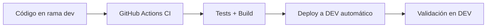
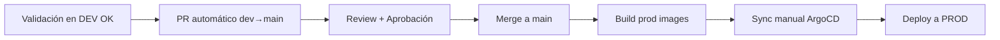

# 🚀 Nueva Estrategia CI/CD - Authentic Platform

## 📋 Resumen de la Estrategia

Esta nueva estrategia GitOps implementa un flujo completo de desarrollo con **ambientes separados** y **validación automática** antes de producción.

## 🏗️ Arquitectura de Ambientes

### 🔧 **Ambiente de Desarrollo (DEV)**
- **Rama**: `dev`
- **Namespace**: `*-dev` (ej: `yosoy-historia-clinica-dev`)  
- **Dominio**: `dev.yo-soy.co`
- **Despliegue**: Automático en cada push a `dev`
- **ArgoCD**: Sync automático habilitado

### 🚀 **Ambiente de Producción (PROD)**
- **Rama**: `main`
- **Namespace**: Nombres originales (ej: `yosoy-historia-clinica`)
- **Dominio**: `yo-soy.co`
- **Despliegue**: Manual (requiere aprobación)
- **ArgoCD**: Sync manual requerido

## 🔄 Flujo de Trabajo (GitOps)

### 1. **Desarrollo** 


### 2. **Promoción a Producción**


## 📁 Estructura de Archivos

```
ci-cd/
├── environments/
│   ├── dev/
│   │   ├── app-of-apps.yaml          # ArgoCD principal DEV
│   │   └── apps/
│   │       ├── yosoy-historia-clinica.yaml
│   │       ├── authenticfarma.yaml
│   │       └── isyours.yaml
│   └── prod/
│       ├── app-of-apps.yaml          # ArgoCD principal PROD  
│       └── apps/
│           ├── yosoy-historia-clinica.yaml
│           ├── authenticfarma.yaml
│           └── isyours.yaml
└── .github/
    └── workflows/
        └── ci-cd-pipeline.yml        # GitHub Actions workflow
```

## 🎯 Beneficios de la Nueva Estrategia

### ✅ **Separación Clara de Ambientes**
- **DEV**: Desarrollo ágil con deploy automático
- **PROD**: Estabilidad con control manual

### ✅ **Validación Automática** 
- Tests automáticos en cada PR
- Build y deploy automático en DEV
- PR automático para promoción

### ✅ **Control de Producción**
- Sync manual requerido
- Review obligatorio
- Rollback controlado

### ✅ **Visibilidad Completa**
- ArgoCD dashboard por ambiente
- GitHub Actions status
- Notificaciones automatizadas

## 🚀 Comandos para Implementar

### 1. **Aplicar ArgoCD DEV**
```bash
kubectl apply -f ci-cd/environments/dev/app-of-apps.yaml
```

### 2. **Aplicar ArgoCD PROD**
```bash  
kubectl apply -f ci-cd/environments/prod/app-of-apps.yaml
```

### 3. **Configurar Secrets de GitHub**
En GitHub → Settings → Secrets, agregar:
- `GCP_SA_KEY`: Service Account key para GCR
- `GITHUB_TOKEN`: Token para crear PRs

## 📋 Workflow Diario

### 👨‍💻 **Para Desarrolladores**

1. **Desarrollar en rama `dev`**:
   ```bash
   git checkout dev
   git pull origin dev
   # hacer cambios
   git add .
   git commit -m "feat: nueva funcionalidad"
   git push origin dev
   ```

2. **Automático**: 
   - ✅ GitHub Actions ejecuta tests
   - ✅ Build y push de imágenes dev
   - ✅ Deploy automático a ambiente DEV
   - ✅ Se crea PR dev→main automático

3. **Validar en DEV**: 
   - 🔍 Probar funcionalidad en `dev.yo-soy.co`
   - 🐛 Si hay bugs, fix en `dev` y repetir

4. **Promover a PROD**:
   - ✅ Review del PR automático
   - ✅ Merge a `main` 
   - ✅ Sync manual en ArgoCD PROD

### 🛡️ **Para DevOps/Admins**

1. **Monitorear ArgoCD**:
   - DEV: Auto-sync habilitado
   - PROD: Sync manual requerido

2. **Aprobar Producción**:
   - Review PR dev→main
   - Verificar cambios
   - Merge cuando esté listo
   - Sync manual en ArgoCD

## 🔗 Enlaces Útiles

- **ArgoCD DEV**: `https://argo.authenticfarma.com/applications/authentic-platform-dev`
- **ArgoCD PROD**: `https://argo.authenticfarma.com/applications/authentic-platform-prod`  
- **GitHub Actions**: `https://github.com/desarrolloIngenios/authentic-platform/actions`

## 🆘 Troubleshooting

### ❌ **Si falla el deploy en DEV**
```bash
# Ver logs de ArgoCD
kubectl logs -n argocd deployment/argocd-application-controller

# Ver status de la app
kubectl get application -n argocd authentic-platform-dev -o yaml
```

### ❌ **Si falla el build de imágenes**
- Verificar secrets `GCP_SA_KEY` en GitHub
- Verificar permisos del Service Account
- Revisar logs en GitHub Actions

### ❌ **Si no se crea el PR automático**
- Verificar secret `GITHUB_TOKEN` en GitHub  
- Verificar permisos del token
- Revisar logs del workflow

---

**🎉 Con esta estrategia tendrás un flujo GitOps completo, seguro y automatizado!**