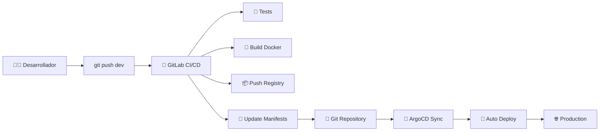

# 🚀 CI/CD Automatizado con ArgoCD - AuthenticFarma Candidatos

## 📋 Flujo de Desarrollo Automatizado

### 🔄 **GitOps Workflow Completo**



## ⚡ **Para Desarrolladores**

### 1. **Desarrollo Normal**
```bash
# 1. Hacer cambios en el código
git checkout dev
# ... realizar cambios ...

# 2. Commit y push (esto activa TODO el flujo)
git add .
git commit -m "feat: nueva funcionalidad"
git push origin dev
```

### 2. **Lo que pasa automáticamente:**
- ✅ **Tests**: PHPUnit y validaciones Laravel
- ✅ **Build**: Construcción de imagen Docker
- ✅ **Registry**: Push a Google Container Registry
- ✅ **GitOps**: Actualización automática de manifiestos K8s
- ✅ **Deploy**: ArgoCD despliega automáticamente a GKE

### 3. **Monitoreo del deployment:**
```bash
# Ver estado de la aplicación en ArgoCD
kubectl get applications -n argocd

# Ver pods desplegados
kubectl get pods -n authenticfarma-candidatos

# Ver logs de la aplicación
kubectl logs -f deployment/authenticfarma-candidatos -n authenticfarma-candidatos -c app
```

## 🛠 **Configuración Técnica**

### **ArgoCD Application**
- **Repositorio**: `https://github.com/desarrolloIngenios/authentic-platform.git`
- **Branch**: `dev` (para desarrollo)
- **Path**: `apps/authenticfarma/candidatos/Kubernetes`
- **Namespace**: `authenticfarma-candidatos`
- **Sync Policy**: Automático con self-heal

### **GitLab CI/CD Pipeline**
- **Archivo**: `apps/authenticfarma/candidatos/.gitlab-ci.yml`
- **Stages**: test → build → publish → update-manifests → notify
- **Registry**: `us-central1-docker.pkg.dev/authentic-prod-464216/authenticfarma-repo`
- **Image naming**: `authentic-candidatos:v{fecha}-{commit}` para main, `dev-{commit}` para dev

### **Kustomization**
- **Archivo**: `apps/authenticfarma/candidatos/Kubernetes/kustomization.yaml`
- **Gestiona**: Image tags, labels, configuración
- **Actualizado por**: CI/CD pipeline automáticamente

## 🔧 **Configuración de Variables**

### **GitLab CI/CD Variables (requeridas)**
```bash
GCP_SERVICE_ACCOUNT_KEY="{json-key-content}"
GITLAB_TOKEN="{token-with-repo-access}"
PROJECT_ID="authentic-prod-464216"
```

### **Secrets de Kubernetes (ya configurados)**
```yaml
laravel-secrets:
  APP_KEY: "{laravel-app-key}"
  DB_USERNAME: "{candidatosuser}"
  DB_PASSWORD: "{db-password}"
  MAIL_USERNAME: "{smtp-user}"
  MAIL_PASSWORD: "{smtp-password}"
```

## 📊 **Monitoreo y Debugging**

### **Ver estado de ArgoCD:**
```bash
# Estado general
kubectl get applications -n argocd

# Estado detallado
kubectl describe application authenticfarma-candidatos -n argocd

# Logs de ArgoCD
kubectl logs -f deployment/argocd-application-controller -n argocd
```

### **Ver recursos desplegados:**
```bash
# Deployment status
kubectl get deployment authenticfarma-candidatos -n authenticfarma-candidatos

# Pod status y logs
kubectl get pods -n authenticfarma-candidatos
kubectl logs -f {pod-name} -n authenticfarma-candidatos -c app

# Service y networking
kubectl get svc,ingress -n authenticfarma-candidatos
```

### **Recursos optimizados aplicados:**
- **App Container**: CPU: 200m-800m, Memory: 400Mi-1Gi
- **SQL Proxy**: CPU: 50m-150m, Memory: 100Mi-200Mi
- **Replicas**: 2 pods con rolling updates
- **Health checks**: Liveness, readiness probes configurados

## 🚨 **Troubleshooting**

### **Si ArgoCD no sincroniza:**
```bash
# Forzar sync manual
kubectl patch application authenticfarma-candidatos -n argocd --type='merge' -p='{"operation":{"sync":{"revision":"HEAD"}}}'
```

### **Si hay problemas de imagen:**
```bash
# Verificar que la imagen existe en el registry
gcloud container images list --repository=us-central1-docker.pkg.dev/authentic-prod-464216/authenticfarma-repo

# Ver eventos del deployment
kubectl describe deployment authenticfarma-candidatos -n authenticfarma-candidatos
```

### **Si fallan los tests:**
```bash
# Ejecutar tests localmente
cd apps/authenticfarma/candidatos
composer install
php artisan test
```

## 🎯 **Beneficios Implementados**

- ✅ **Automatización completa**: Push → Deploy en ~5-10 minutos
- ✅ **GitOps**: Toda la configuración versionada en Git
- ✅ **Rolling updates**: Cero downtime en deployments
- ✅ **Self-healing**: ArgoCD corrige drift automáticamente
- ✅ **Trazabilidad**: Cada deployment ligado a un commit específico
- ✅ **Rollbacks fáciles**: Git revert + ArgoCD sync automático
- ✅ **Recursos optimizados**: Performance mejorada para carga concurrente

## 📚 **Enlaces Útiles**

- **Aplicación**: https://candidatos.authenticfarma.com
- **ArgoCD UI**: `kubectl port-forward svc/argocd-server -n argocd 8080:443`
- **Monitoring**: `kubectl top pods -n authenticfarma-candidatos`
- **Repository**: https://github.com/desarrolloIngenios/authentic-platform

---

**🎉 ¡El flujo de CI/CD está completamente automatizado! Los desarrolladores solo necesitan hacer `git push` y todo el resto sucede automáticamente.**